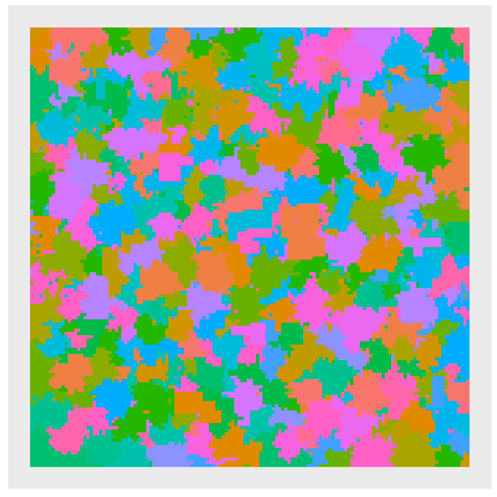

```{r setup, include=FALSE}
library(ggplot2)
library(reshape2)
library(knitr)
library(dplyr)
library(stringr)
library(tidyverse)
library(readr)
library(collections)
options(scipen = 999)
```

```{r}
input<-read_lines("Day12Sample1.txt")
### Garden Matrix
garden<-matrix(nrow=length(input),ncol=nchar(input[1]))
for(i in 1:length(input)){garden[i,]<-unlist(str_split(input[i],""))}
```

```{r,include=FALSE,eval=FALSE}
bg<-melt(garden)
basicgraph<-ggplot(data=bg,aes(x<-Var2,y=Var1,fill=value))+
  geom_tile()+
  theme(axis.text.x = element_blank(),
        axis.ticks.x = element_blank(),
        axis.text.y = element_blank(),
        axis.ticks.y = element_blank(),
        axis.title.y = element_blank(),
        axis.title.x = element_blank(),
        panel.grid.major = element_blank(),
        panel.grid.minor = element_blank(),
        legend.position="none")+
  scale_y_reverse()+
  coord_fixed()
basicgraph
```

```{r echo=FALSE, fig.cap="Graph of the garden", out.width = '50%'}

```

## Part 1
Search  - the search starts in the upper left hand corner and moves through each cell to the bottom right hand corner. When it gets to a plot that it hasn't been to before, it searches around until it finds every plot in the region and the area and perimeter of the region. The area is the count of all plots.  The perimeter is found by testing every direction - if there's a direction where you'd go into another region (or off the edge of the garden), the perimeter increments by one

```{r}
fencecost<-function(g){
  ###
  maxc<-ncol(g)
  maxr<-nrow(g)
  beenthere<-dict()
  totalfence<-0
  ### until everything has been found - 
  x<-1
  y<-1
  while(beenthere$size()<maxr*maxc){
    ### if have been there already, keep looking for somewhere that it hasn't been yet
    while(beenthere$has(str_flatten(c(x,y),"~"))){
      x<-x+1
      if(x>maxc){
        y<-y+1
        x<-1}}
    a<-0
    p<-0
    r<-g[y,x]
    q<-queue()
    ### just to check
    q$push(c(x,y))
    while(q$size()>0){
      nxt<-q$pop()
      nxtx<-nxt[1]
      nxty<-nxt[2]
      ## if have been there, next
      if(beenthere$has(str_flatten(c(nxtx,nxty),"~"))){
        next}else{beenthere$set(str_flatten(c(nxtx,nxty),"~"),r)}
      ### if this is a new place, add 1 to the area
      a<-a+1
      ### check on all 4 sides
      if(nxtx>1){
        if(g[nxty,(nxtx-1)]==r){
          q$push(c(nxtx-1,nxty))}else{
            p<-p+1}}else{p<-p+1}

      if(nxtx<maxc){
        if(g[nxty,(nxtx+1)]==r){
          q$push(c(nxtx+1,nxty))}else{
            p<-p+1}}else{p<-p+1}
        
      if(nxty>1){
        if(g[(nxty-1),nxtx]==r){
          q$push(c(nxtx,nxty-1))}else{
            p<-p+1}}else{p<-p+1}
        
      if(nxty<maxr){
        if(g[(nxty+1),nxtx]==r){
          q$push(c(nxtx,nxty+1))}else{
            p<-p+1}}else{p<-p+1}
      }
    totalfence<-totalfence+(a*p)}
  totalfence}


```

```{r}
part1<-fencecost(garden)
part1
```
## Part 2
Got the idea from online (subreddit) to count corners as there is one corner for every side.  Otherwise, it works a lot like part 1

```{r}
cheapfencing<-function(g){
  ###
  maxc<-ncol(g)
  maxr<-nrow(g)
  beenthere<-dict()
  totalfence<-0
  ### until everything has been found - 
  x<-1
  y<-1
  while(beenthere$size()<maxr*maxc){
    ### if have been there already, keep looking for somewhere that it hasn't been yet
    while(beenthere$has(str_flatten(c(x,y),"~"))){
      x<-x+1
      if(x>maxc){
        y<-y+1
        x<-1}}
    a<-0
    corner<-0
    r<-g[y,x]
    q<-queue()
    ### just to check
    q$push(c(x,y))
    while(q$size()>0){
      nxt<-q$pop()
      nxtx<-nxt[1]
      nxty<-nxt[2]
      ## for cornering
      up<-FALSE
      left<-FALSE
      down<-FALSE
      right<-FALSE
      ## if have been there, next
      if(beenthere$has(str_flatten(c(nxtx,nxty),"~"))){
        next}else{beenthere$set(str_flatten(c(nxtx,nxty),"~"),r)}
      ### if this is a new place, add 1 to the area
      a<-a+1
      ### check on all 4 sides
      if(nxtx>1){
        if(g[nxty,(nxtx-1)]==r){
          q$push(c(nxtx-1,nxty))
          left<-TRUE}else{
            left<-FALSE}}else{left<-FALSE}
      if(nxtx<maxc){
        if(g[nxty,(nxtx+1)]==r){
          q$push(c(nxtx+1,nxty))
          right<-TRUE}else{
            right<-FALSE}}else{right<-FALSE}
      if(nxty>1){
        if(g[(nxty-1),nxtx]==r){
          q$push(c(nxtx,nxty-1))
          up<-TRUE}else{
            up<-FALSE}}else{up<-FALSE}
      if(nxty<maxr){
        if(g[(nxty+1),nxtx]==r){
          q$push(c(nxtx,nxty+1))
          down<-TRUE}else{
            down<-FALSE}}else{down<-FALSE}
      ### to find corners - check in two cornerly directions. If both are false, corner
      ### if both are true, then check kitty corner - if it is a different region, then corner
      if(up==FALSE && left==FALSE){corner<-corner+1}
      if(up==FALSE && right==FALSE){corner<-corner+1}
      if(down==FALSE && left==FALSE){corner<-corner+1}
      if(down==FALSE && right==FALSE){corner<-corner+1}
      if(up==TRUE && left==TRUE && g[(nxty-1),(nxtx-1)]!=r){corner<-corner+1}
      if(up==TRUE && right==TRUE && g[(nxty-1),(nxtx+1)]!=r){corner<-corner+1}
      if(down==TRUE && left==TRUE && g[(nxty+1),(nxtx-1)]!=r){corner<-corner+1}
      if(down==TRUE && right==TRUE && g[(nxty+1),(nxtx+1)]!=r){corner<-corner+1}}
    totalfence<-totalfence+(a*corner)}
  totalfence}


```

```{r}
part2<-cheapfencing(garden)
part2
```
