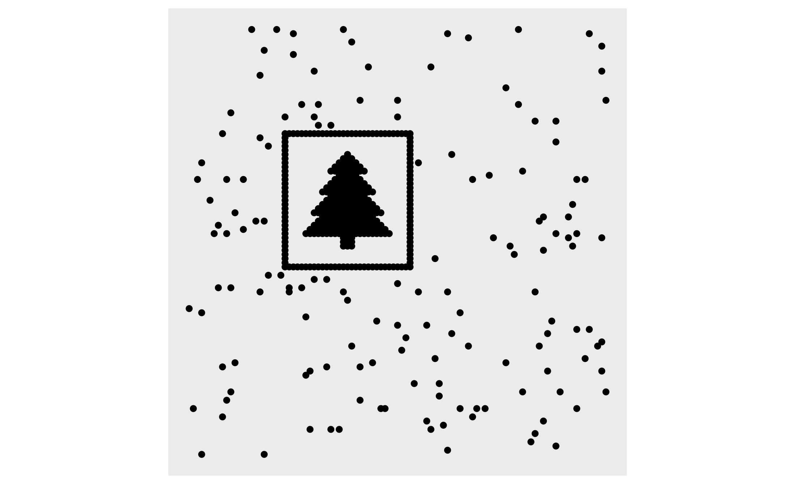

```{r setup, include=FALSE}
library(RColorBrewer)
library(gganimate)
library(ggplot2)
library(reshape2)
library(knitr)
library(dplyr)
library(stringr)
library(tidyverse)
library(readr)
library(collections)
options(scipen = 999)
```

```{r}
input<-read_lines("Day14Sample.txt")

robotframe<-as.data.frame(matrix(ncol=4,nrow=0))
for(i in 1:length(input)){
  y<-as.numeric(unlist(str_extract_all(input[i],"-?\\d+")))
  robotframe<-rbind(robotframe,y)}
colnames(robotframe)<-c("px","py","vx","vy")
```

## Part 1
Move everything about in the frame and then count how many are in each quadrant
```{r}
safetyfactor<-function(rf,max_x,max_y,s){
  midx<-max_x%/%2
  midy<-max_y%/%2
  rf<-rf%>%rowwise%>%
    ### find the final x & y position
    mutate(finalx=((px+s*vx)%%max_x),finaly=((py+s*vy)%%max_y)) %>%
    ### find which quadrant it is in
    mutate(quad=if_else(finalx<midx&&finaly<midy,1,
                        if_else(finalx>midx&&finaly<midy,2,
                                if_else(finalx<midx&&finaly>midy,3,
                                        if_else(finalx>midx&&finaly>midy,4,0)))))
  sf<-rf%>%count(quad)%>%filter(quad!=0)%>%arrange(quad)
  sf<-sf$n
  sf}
```

```{r}
p1<-safetyfactor(robotframe,11,7,100)
p1
part1<-prod(p1)
part1
```


## Part 2
Because there is a repeat every 10403, animate and watch that long is a possibility, but that's a lot of rendering and watching

My first idea was that the tree would be centered around the midline - so I was looking for symmetry across the quadrants - that went nowhere.


Then, I thought about looking for anomalies in the safety factor - 

This slightly alters the safetyfactor function from above

```{r}
safac2<-function(rf,max_x,max_y,s){
  midx<-max_x%/%2
  midy<-max_y%/%2
  rf<-rf%>%rowwise%>%
    ### find the final x & y position
    mutate(finalx=((px+s*vx)%%max_x),finaly=((py+s*vy)%%max_y)) %>%
    select(finalx,finaly)%>%
    ### find which quadrant it is in
    mutate(quad=if_else(finalx<midx&&finaly<midy,1,
                        if_else(finalx>midx&&finaly<midy,2,
                                if_else(finalx<midx&&finaly>midy,3,
                                        if_else(finalx>midx&&finaly>midy,4,0)))))
  sf<-rf%>%count(quad)%>%filter(quad!=0)%>%arrange(quad)
  sf<-sf$n
  sf<-c(sf,prod(sf))
  sf}

### find tree runs this through all repeats.  It also takes forever.

findtree<-function(rf,max_x,max_y){
  treeframe<-as.data.frame(matrix(ncol=6,nrow=0))
  for(i in 1:(max_x*max_y)){
    t<-safac2(rf,max_x,max_y,i)
    treeframe<-rbind(treeframe,c(i,t))}
  colnames(treeframe)<-c("dex","q1","q2","q3","q4","safetyfactor")
  treeframe}
```

Running this allowed me to look for clumps

```{r,eval=FALSE}
quadsearch<-findtree(robotframe,101,103)
```


```{r,echo=FALSE,eval=FALSE}
lookforclumps<-ggplot(data=quadsearch)+
  geom_path(aes(x=dex,y=q1),color="#FF00FF")+
  geom_path(aes(x=dex,y=q2),color="#00FF00")+
  geom_path(aes(x=dex,y=q3),color="#0000FF")+
  geom_path(aes(x=dex,y=q4),color="#FF0000")+
  theme(axis.text.x = element_blank(),
        axis.ticks.x = element_blank(),
        axis.text.y = element_blank(),
        axis.ticks.y = element_blank(),
        axis.title.y = element_blank(),
        axis.title.x = element_blank(),
        panel.grid.major = element_blank(),
        panel.grid.minor = element_blank(),
        legend.position="none")+
  scale_y_reverse()+
  coord_fixed()
lookforclumps
```


The plot shows that right around 7000, theres an especially large group of robots in q1.  

And plotting that one specifically shows

```{r,eval=FALSE}
plottree<-function(rf,max_x,max_y,s){
  midx<-max_x%/%2
  midy<-max_y%/%2
  rf<-rf%>%rowwise%>%
    ### find the final x & y position
    mutate(finalx=((px+s*vx)%%max_x),finaly=((py+s*vy)%%max_y)) %>%
    ### find which quadrant it is in
    select(finalx,finaly)
  rf}

sevenzerofivefive<-plottree(robotframe,101,103,7055)

second_7055<-ggplot(data=sevenzerofivefive,aes(x=finalx,y=finaly))+
  geom_point()+
  theme(axis.text.x = element_blank(),
        axis.ticks.x = element_blank(),
        axis.text.y = element_blank(),
        axis.ticks.y = element_blank(),
        axis.title.y = element_blank(),
        axis.title.x = element_blank(),
        panel.grid.major = element_blank(),
        panel.grid.minor = element_blank(),
        legend.position="none")+
  scale_y_reverse()+
  coord_fixed()
second_7055
```

```{r echo=FALSE, fig.cap="Tree", out.width = '50%'}

```


Finally - here's a sped up version of the 4 minutes before the tree appears.

```{r,include=FALSE,eval=FALSE}
#### re runs and saves everything to a dataframe - also, indicates
#### tracks the robots
visualeffect2<-function(rf,max_x,max_y,beginsec,endsec){
  rf<-cbind(rf,robot=1:nrow(rf))
  everything<-as.data.frame(matrix(nrow=0,ncol=4))
  for(i in beginsec:endsec){
    rf<-rf%>%rowwise%>%
    ### find the final x & y position
      mutate(finalx=((px+i*vx)%%max_x),finaly=((py+i*vy)%%max_y))
    tmp<-rf %>% select(finalx,finaly,robot) %>%
      mutate(s=i)
    everything<-rbind(everything,tmp)}
  everything}

#### saves the data for the 250 before the tree appears

visualize14<-visualeffect2(robotframe,101,103,6806,7055)
```


```{r,include=FALSE,eval=FALSE}
#### creates the plots

its_a_tree<-ggplot(data=visualize14)+
  geom_point(aes(x=finalx,y=finaly,colour=robot),size=5)+
  scale_colour_gradientn(colours = brewer.pal(9, "Greens"))+
  theme(axis.text.x = element_blank(),
        axis.ticks.x = element_blank(),
        axis.text.y = element_blank(),
        axis.ticks.y = element_blank(),
        axis.title.y = element_blank(),
        axis.title.x = element_blank(),
        panel.grid.major = element_blank(),
        panel.grid.minor = element_blank(),
        panel.background = element_rect(fill='transparent'),
        plot.background = element_rect(fill='transparent', color=NA),
        legend.position="none")+
  scale_y_reverse()+
  coord_fixed()+
  transition_states(s,wrap=FALSE)+
  shadow_wake(wake_length =.04,size=.5,alpha=3,wrap=FALSE,exclude_phase=c("exit"))

#### creates the animation


 anim_save("its_a_tree_tsp.gif",animate(its_a_tree,nframes = 250, end_pause=30))
```


```{r echo=FALSE, fig.cap="Robots Wandering", out.width = '50%'}
knitr::include_graphics("its_a_tree_tsp.gif")
```
