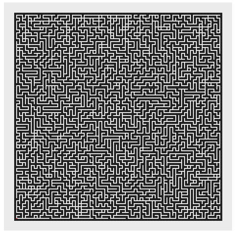

```{r setup, include=FALSE}
library(gganimate)
library(ggplot2)
library(reshape2)
library(knitr)
library(dplyr)
library(stringr)
library(tidyverse)
library(readr)
library(collections)
options(scipen = 999)
```

```{r}
input<-read_lines("Day16Sample1.txt")
### make the maze into a dict, find the start and end
reindeermaze<-dict()
for(i in 1:length(input)){
  x<-unlist(str_split(input[i],""))
  for(j in 1:length(x)){
    switch(x[j],
           "#"=reindeermaze$set(str_flatten(c(i,j),"~"),0),
           "S"=reinstart<-c(i,j),
           "E"=reinend<-c(i,j),
           {})}}
```


## Part 1
Just a very, very straightforward search - 

N=0
E=1
S=2
W=3

```{r}
mazepath<-function(mz,st,en){
  beenthere<-dict()
  pq<-priority_queue()
  ### pushing starting position, direction, & score
  ### pq is the distance to the end + the current score 
  pq$push(c(st,1,0),-sum(abs(st-en)))
  while(pq$size()>0){
    curr<-pq$pop()
    ### if at the end, leave
    if(all(curr[1:2]==en)){return(curr[4])}
    ### if have been there facing that direction, stop
    if(beenthere$has(str_flatten(curr[1:3],"~"))){next}
    beenthere$set(str_flatten(curr[1:3],"~"),0)
    ### turn clockwise & counterclockwise
    pq$push(c(curr[1:2],(curr[3]+1)%%4,curr[4]+1000),-sum(abs(en-curr[1:2]),curr[4]))
    pq$push(c(curr[1:2],(curr[3]-1)%%4,curr[4]+1000),-sum(abs(en-curr[1:2]),curr[4]))
    ### move, depending on which direction currently facing
    nxt<-FALSE
    d<-as.character(curr[3])
    switch(d,
           "0"=if(!mz$has(str_flatten(curr[1:2]+c(-1,0),"~"))){nxt<-curr[1:2]+c(-1,0)},
           "1"=if(!mz$has(str_flatten(curr[1:2]+c(0,1),"~"))){nxt<-curr[1:2]+c(0,1)},
           "2"=if(!mz$has(str_flatten(curr[1:2]+c(1,0),"~"))){nxt<-curr[1:2]+c(1,0)},
           "3"=if(!mz$has(str_flatten(curr[1:2]+c(0,-1),"~"))){nxt<-curr[1:2]+c(0,-1)},
           cat("bad direction\n"))
    if(!any(nxt==FALSE)){
      pq$push(c(nxt,curr[3],curr[4]+1),-sum(abs(en-nxt),curr[4]))}}
  beenthere}
```


```{r}
part1<-mazepath(reindeermaze,reinstart,reinend)
part1
```
## Part 2
Because I need to save the path during the search (and return all paths), I need to make some small changes:

```{r}
bestseat<-function(mz,st,en){
  beenthere<-dict()
  pq<-priority_queue()
  ### pushing starting position, direction, score, and path
  ### pq is the distance to the end + the current score
  pq$push(list(st[1],st[2],1,0,c(str_flatten(st,"~"))),-sum(abs(st-en)))
  bestlength<-Inf
  paths<-c()
  closer<-0
  winctr<-0
  while(pq$size()>0){
    currlist<-pq$pop()
    curr<-unlist(currlist[1:4])
    pth<-unlist(currlist[5])
    ### if the current score > bestlength - stop
    if(curr[4]>bestlength){break}
    ### if at the end
    if(all(curr[1:2]==en)){
      ### if this is shorter than the best length
      if(curr[4]<bestlength){
        ### make this the new bestlength
        bestlength<-curr[4]
        ### this is the new best path list (should only happen once, but just in case)
        paths<-pth
        ### if this matches the best length
      }else if(curr[4]==bestlength){
        ### add this path to the list of path seats
        paths<-c(paths,pth)}
    next}
    ### check if we've been there faster - if faster, drop - if slower or equal, keep going
    if(beenthere$has(str_flatten(curr[1:3],"~"))){
      when<-beenthere$get(str_flatten(curr[1:3],"~"))
      if(when<curr[4]){next}}
    beenthere$set(str_flatten(curr[1:3],"~"),curr[4])
    ### turn clockwise & counterclockwise
    pq$push(list(curr[1],curr[2],(curr[3]+1)%%4,curr[4]+1000,pth),-sum(abs(en-curr[1:2]),curr[4]))
    pq$push(list(curr[1],curr[2],(curr[3]-1)%%4,curr[4]+1000,pth),-sum(abs(en-curr[1:2]),curr[4]))
    ### move, depending on which direction currently facing
    nxt<-FALSE
    d<-as.character(curr[3])
    switch(d,
           "0"=if(!mz$has(str_flatten(curr[1:2]+c(-1,0),"~"))){nxt<-curr[1:2]+c(-1,0)},
           "1"=if(!mz$has(str_flatten(curr[1:2]+c(0,1),"~"))){nxt<-curr[1:2]+c(0,1)},
           "2"=if(!mz$has(str_flatten(curr[1:2]+c(1,0),"~"))){nxt<-curr[1:2]+c(1,0)},
           "3"=if(!mz$has(str_flatten(curr[1:2]+c(0,-1),"~"))){nxt<-curr[1:2]+c(0,-1)},
           cat("bad direction\n"))
    if(!any(nxt==FALSE)){
      pq$push(list(nxt[1],nxt[2],curr[3],curr[4]+1,c(pth,str_flatten(nxt,"~"))),-sum(abs(en-nxt),curr[4]))}}
  unique(paths)}
```


```{r}
p2<-bestseat(reindeermaze,reinstart,reinend)
part2<-length(p2)
part2
```
```{r echo=FALSE, fig.cap="Best Paths", out.width = '50%'}

```

```{r,include=FALSE,eval=FALSE}
### Graph Stuff


grdf<-as.data.frame(matrix(nrow=0,ncol=3))
i<-1
ct<-1
while(i<length(p2)){
  if(p2[i+1]!="140~2"){
    grdf<-rbind(grdf,c(p2[i],p2[i+1],ct))
    }else{ct<-0}
  i<-i+1
  ct<-ct+1}
colnames(grdf)<-c("s","e","t")


grdf<-grdf%>%rowwise%>%mutate(xs=as.numeric(unlist(str_split_i(s,"~",2))),
                              xe=as.numeric(unlist(str_split_i(e,"~",2))),
                              ys=as.numeric(unlist(str_split_i(s,"~",1))),
                              ye=as.numeric(unlist(str_split_i(e,"~",1))))%>%
  select(-c(s,e))


quickgrdf<-unique(grdf)%>%mutate(t=as.numeric(t))

grbck<-as.data.frame(matrix(ncol=2,nrow=0))
reinmzkeys<-unlist(as.list(reindeermaze$keys()))
for(i in 1:length(reinmzkeys)){grbck<-rbind(grbck,as.numeric(unlist(str_split(reinmzkeys[i],"~"))))}
colnames(grbck)<-c("wally","wallx")

reinmazegraph<-ggplot(quickgrdf)+
  geom_tile(data=grbck,aes(x=wallx,y=wally),color="#444444")+
  geom_segment(aes(x=xs,y=ys,xend=xe,yend=ye),color="#FF0000")+
  theme(axis.text.x = element_blank(),
        axis.ticks.x = element_blank(),
        axis.text.y = element_blank(),
        axis.ticks.y = element_blank(),
        axis.title.y = element_blank(),
        axis.title.x = element_blank(),
        panel.grid.major = element_blank(),
        panel.grid.minor = element_blank(),
        legend.position="none")+
  scale_y_reverse()+
  coord_fixed()+
  transition_states(t,wrap=FALSE)+
  shadow_mark()
reinmazegraph
```

