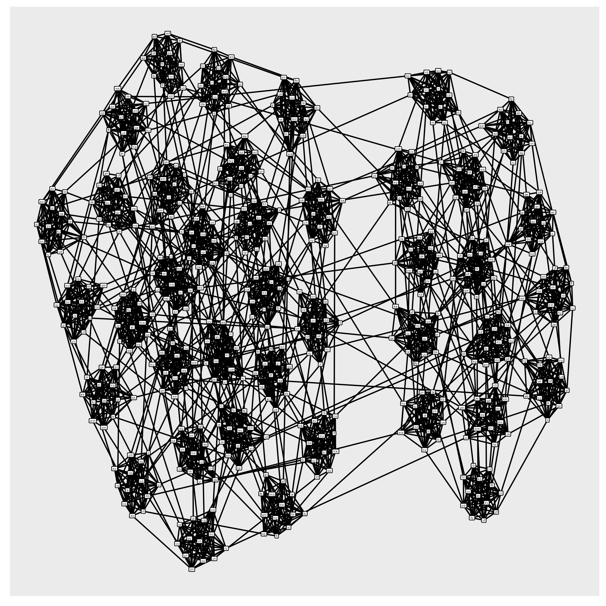

```{r setup, include=FALSE}
library(igraph)
library(rgl)
library(ggraph)
library(reshape2)
library(knitr)
library(dplyr)
library(stringr)
library(tidyverse)
library(readr)
library(collections)
options(scipen = 999)
```

```{r}
input<-read_lines("Day23Sample.txt")
dlports<-matrix(ncol=2,nrow=0)
## Pull in the edges, put them into a graph
for(i in 1:length(input)){
  x<-unlist(str_split(input[i],"-"))
  dlports<-rbind(dlports,x)}
dlgraph<-graph_from_edgelist(dlports,directed=FALSE)
```

Graphs!!!!!

```{r, echo=FALSE}
langraph<-ggraph(dlgraph,layout="graphopt")+
  geom_edge_fan()+
  geom_node_label(aes(label=name),size=5)
langraph
```

```{r pressure, echo=FALSE, out.width = '75%'}

```


```{r}
### Cliques brings the groups of three
dlcliques<-cliques(dlgraph,max=3,min=3)
### Get the vertex names
triplets<-lapply(dlcliques,function(x){vertex(x)[[1]]$name})
### Get the count of any that have a vertex beginning with a T
p1<-sapply(triplets,function(x){t<-if(any(str_starts(x,"t"))){1}else{0}})
part1<-sum(p1)
part1
```


## Part 2


```{r}
### Get the largest clique, sort their vertices
part2<-str_flatten(sort(vertex(largest_cliques(dlgraph))[[1]][[1]]$name),",")
part2
```

