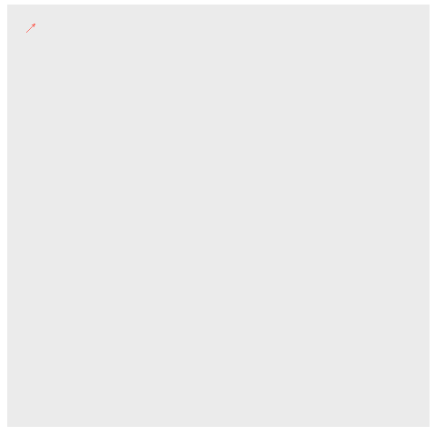
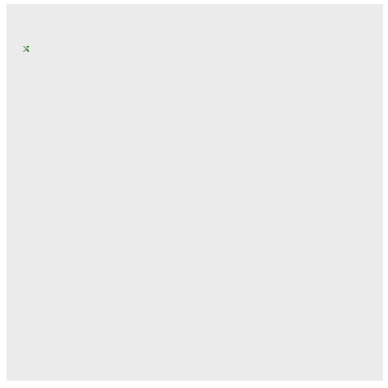

```{r setup, include=FALSE}
library(gganimate)
library(ggplot2)
library(reshape2)
library(knitr)
library(dplyr)
library(stringr)
library(tidyverse)
library(readr)
library(collections)
options(scipen = 999)
```

```{r}
input<-read_lines("Day4Sample.txt")

### put the wordsearch in a matrix
wordsearch<-matrix(nrow=length(input),ncol=nchar(input[1]))
for(i in 1:length(input)){wordsearch[i,]<-unlist(str_split(input[i],""))}

```

## Part 1
I feel like this is a horrible idea.  But, just looking in all 8 directions around an X works.

```{r}
lookingforxmas<-function(wsm){
  xmascounter<-0
  for(x in 1:ncol(wsm)){
    for(y in 1:nrow(wsm)){
      ## Check to see if it's an "X" otherwise move on
      if(wsm[y,x]!="X"){
        next}else{
          ### check up
          if(y>=4){
            if(wsm[y-1,x]=="M"&&wsm[y-2,x]=="A"&&wsm[y-3,x]=="S"){xmascounter<-xmascounter+1}}
          ### check up right
          if(y>=4&&x<=(ncol(wsm)-3)){
            if(wsm[y-1,x+1]=="M"&&wsm[y-2,x+2]=="A"&&wsm[y-3,x+3]=="S"){xmascounter<-xmascounter+1}}
          ### check right
          if(x<=(ncol(wsm)-3)){
            if(wsm[y,x+1]=="M"&&wsm[y,x+2]=="A"&&wsm[y,x+3]=="S"){xmascounter<-xmascounter+1}}
          ### check down right
          if(x<=(ncol(wsm)-3)&&y<=(nrow(wsm)-3)){
            if(wsm[y+1,x+1]=="M"&&wsm[y+2,x+2]=="A"&&wsm[y+3,x+3]=="S"){xmascounter<-xmascounter+1}}
          ### check down
          if(y<=(nrow(wsm)-3)){
            if(wsm[y+1,x]=="M"&&wsm[y+2,x]=="A"&&wsm[y+3,x]=="S"){xmascounter<-xmascounter+1}}
          ### check down left
          if(y<=(nrow(wsm)-3)&&x>=4){
            if(wsm[y+1,x-1]=="M"&&wsm[y+2,x-2]=="A"&&wsm[y+3,x-3]=="S"){xmascounter<-xmascounter+1}}
          ### check left
          if(x>=4){
            if(wsm[y,x-1]=="M"&&wsm[y,x-2]=="A"&&wsm[y,x-3]=="S"){xmascounter<-xmascounter+1}}
          ### check up left
          if(x>=4&&y>=4){
            if(wsm[y-1,x-1]=="M"&&wsm[y-2,x-2]=="A"&&wsm[y-3,x-3]=="S"){xmascounter<-xmascounter+1}}
        }
    }
  }
  
xmascounter}
```

```{r}
part1<-lookingforxmas(wordsearch)
part1
```


## Part 2
Same thing, but look for M's on the top, right, bottom, left of an A.

```{r}
lookingforcrossedmas<-function(wsm){
  mascounter<-0
  ### only check for A's that aren't on the edges
  for(x in 2:(ncol(wsm)-1)){
    for(y in 2:(nrow(wsm)-1)){
      ## Check to see if it's an "X" otherwise move on
      if(wsm[y,x]!="A"){
        next}else{
          ### Clockwise MMSS
          if(wsm[y-1,x-1]=="M"&&wsm[y-1,x+1]=="M"&&wsm[y+1,x+1]=="S"&&wsm[y+1,x-1]=="S"){mascounter<-mascounter+1}
          ### Clockwise SMMS
          if(wsm[y-1,x-1]=="S"&&wsm[y-1,x+1]=="M"&&wsm[y+1,x+1]=="M"&&wsm[y+1,x-1]=="S"){mascounter<-mascounter+1}
          ### Clockwise SSMM
          if(wsm[y-1,x-1]=="S"&&wsm[y-1,x+1]=="S"&&wsm[y+1,x+1]=="M"&&wsm[y+1,x-1]=="M"){mascounter<-mascounter+1}
          ### Clockwise MSSM
          if(wsm[y-1,x-1]=="M"&&wsm[y-1,x+1]=="S"&&wsm[y+1,x+1]=="S"&&wsm[y+1,x-1]=="M"){mascounter<-mascounter+1}
          
        }}}
  mascounter}

```

```{r}
part2<-lookingforcrossedmas(wordsearch)
part2
```



```{r,include=FALSE,eval=FALSE}
#### All of this is for the GIFs
input<-read_lines("../../AoCData/AOC2024/Day4.txt")

### put the wordsearch in a matrix
wordsearch<-matrix(nrow=length(input),ncol=nchar(input[1]))
for(i in 1:length(input)){wordsearch[i,]<-unlist(str_split(input[i],""))}


lookingforxmasg1<-function(wsm){
  xmascounter<-0
  wsdf<-data.frame(matrix(nrow=0,ncol=5))
  for(x in 1:ncol(wsm)){
    for(y in 1:nrow(wsm)){
      ## Check to see if it's an "X" otherwise move on
      if(wsm[y,x]!="X"){
        next}else{
          ### check up
          if(y>=4){
            if(wsm[y-1,x]=="M"&&wsm[y-2,x]=="A"&&wsm[y-3,x]=="S"){xmascounter<-xmascounter+1
            wsdf<-rbind(wsdf,c(x,y,x,y-3,xmascounter))}}
          ### check up right
          if(y>=4&&x<=(ncol(wsm)-3)){
            if(wsm[y-1,x+1]=="M"&&wsm[y-2,x+2]=="A"&&wsm[y-3,x+3]=="S"){xmascounter<-xmascounter+1
            wsdf<-rbind(wsdf,c(x,y,x+3,y-3,xmascounter))}}
          ### check right
          if(x<=(ncol(wsm)-3)){
            if(wsm[y,x+1]=="M"&&wsm[y,x+2]=="A"&&wsm[y,x+3]=="S"){xmascounter<-xmascounter+1
            wsdf<-rbind(wsdf,c(x,y,x+3,y,xmascounter))}}
          ### check down right
          if(x<=(ncol(wsm)-3)&&y<=(nrow(wsm)-3)){
            if(wsm[y+1,x+1]=="M"&&wsm[y+2,x+2]=="A"&&wsm[y+3,x+3]=="S"){xmascounter<-xmascounter+1
            wsdf<-rbind(wsdf,c(x,y,x+3,y+3,xmascounter))}}
          ### check down
          if(y<=(nrow(wsm)-3)){
            if(wsm[y+1,x]=="M"&&wsm[y+2,x]=="A"&&wsm[y+3,x]=="S"){xmascounter<-xmascounter+1
            wsdf<-rbind(wsdf,c(x,y,x,y+3,xmascounter))}}
          ### check down left
          if(y<=(nrow(wsm)-3)&&x>=4){
            if(wsm[y+1,x-1]=="M"&&wsm[y+2,x-2]=="A"&&wsm[y+3,x-3]=="S"){xmascounter<-xmascounter+1
            wsdf<-rbind(wsdf,c(x,y,x-3,y+3,xmascounter))}}
          ### check left
          if(x>=4){
            if(wsm[y,x-1]=="M"&&wsm[y,x-2]=="A"&&wsm[y,x-3]=="S"){xmascounter<-xmascounter+1
            wsdf<-rbind(wsdf,c(x,y,x-3,y,xmascounter))}}
          ### check up left
          if(x>=4&&y>=4){
            if(wsm[y-1,x-1]=="M"&&wsm[y-2,x-2]=="A"&&wsm[y-3,x-3]=="S"){xmascounter<-xmascounter+1
            wsdf<-rbind(wsdf,c(x,y,x-3,y-3,xmascounter))}}
        }
    }
  }
  
wsdf}

p1df<-lookingforxmasg1(wordsearch)
colnames(p1df)<-c("x1","y1","x2","y2","t")


p1g<-ggplot(data=p1df)+
  geom_segment(aes(x=x1,y=y1,xend=x2,yend=y2,colour="#FF0000"),arrow = arrow(length = unit(0.05, "inches")))+
  theme(axis.text.x = element_blank(),
        axis.ticks.x = element_blank(),
        axis.text.y = element_blank(),
        axis.ticks.y = element_blank(),
        axis.title.y = element_blank(),
        axis.title.x = element_blank(),
        panel.grid.major = element_blank(),
        panel.grid.minor = element_blank(),
        legend.position="none")+
  scale_y_reverse()+
  coord_fixed()+
  transition_manual(t,cumulative = TRUE)+
  shadow_mark()

p1anim <- animate(p1g,end_pause = 5)
p1anim
#anim_save("xmasarrows.gif",p1anim)
```


```{r,include=FALSE,eval=FALSE}
lookingforcrossedmasg2<-function(wsm){
  mascounter<-0
  wsdf<-data.frame(matrix(nrow=0,ncol=5))
  ### only check for A's that aren't on the edges
  for(x in 2:(ncol(wsm)-1)){
    for(y in 2:(nrow(wsm)-1)){
      ## Check to see if it's an "X" otherwise move on
      if(wsm[y,x]!="A"){
        next}else{
          ### Clockwise MMSS
          if(wsm[y-1,x-1]=="M"&&wsm[y-1,x+1]=="M"&&wsm[y+1,x+1]=="S"&&wsm[y+1,x-1]=="S"){mascounter<-mascounter+1
          wsdf<-rbind(wsdf,c(x+1,y-1,x-1,y+1,mascounter))
          wsdf<-rbind(wsdf,c(x+1,y+1,x-1,y-1,mascounter))}
          ### Clockwise SMMS
          if(wsm[y-1,x-1]=="S"&&wsm[y-1,x+1]=="M"&&wsm[y+1,x+1]=="M"&&wsm[y+1,x-1]=="S"){mascounter<-mascounter+1
          wsdf<-rbind(wsdf,c(x+1,y+1,x-1,y-1,mascounter))
          wsdf<-rbind(wsdf,c(x-1,y+1,x+1,y-1,mascounter))}
          ### Clockwise SSMM
          if(wsm[y-1,x-1]=="S"&&wsm[y-1,x+1]=="S"&&wsm[y+1,x+1]=="M"&&wsm[y+1,x-1]=="M"){mascounter<-mascounter+1
          wsdf<-rbind(wsdf,c(x+1,y+1,x-1,y-1,mascounter))
          wsdf<-rbind(wsdf,c(x-1,y+1,x+1,y-1,mascounter))}
          ### Clockwise MSSM
          if(wsm[y-1,x-1]=="M"&&wsm[y-1,x+1]=="S"&&wsm[y+1,x+1]=="S"&&wsm[y+1,x-1]=="M"){mascounter<-mascounter+1
          wsdf<-rbind(wsdf,c(x-1,y-1,x+1,y+1,mascounter))
          wsdf<-rbind(wsdf,c(x-1,y+1,x+1,y-1,mascounter))}
        }}}
  wsdf}

p2df<-lookingforcrossedmasg2(wordsearch)
colnames(p2df)<-c("x1","y1","x2","y2","t")

p2g<-ggplot(data=p2df)+
  geom_segment(aes(x=x1,y=y1,xend=x2,yend=y2),colour="#006600",arrow = arrow(length = unit(0.03, "inches")))+
  theme(axis.text.x = element_blank(),
        axis.ticks.x = element_blank(),
        axis.text.y = element_blank(),
        axis.ticks.y = element_blank(),
        axis.title.y = element_blank(),
        axis.title.x = element_blank(),
        panel.grid.major = element_blank(),
        panel.grid.minor = element_blank(),
        legend.position="none")+
  scale_y_reverse()+
  coord_fixed()+
  transition_manual(t,cumulative = TRUE)+
  shadow_mark()

p2anim <- animate(p2g,end_pause = 5)
p2anim
#anim_save("crossedmasarrows.gif",p2anim)
```

