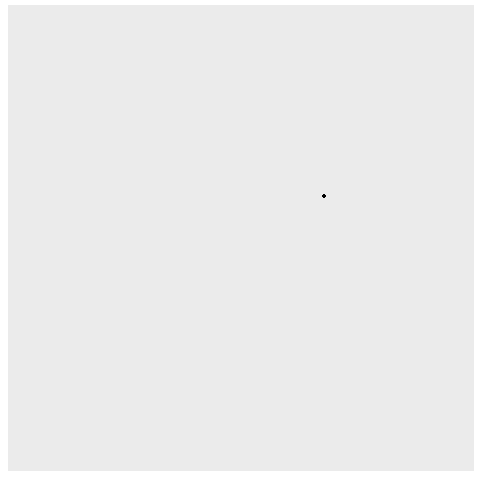

```{r setup, include=FALSE}
library(gganimate)
library(ggplot2)
library(reshape2)
library(knitr)
library(dplyr)
library(stringr)
library(tidyverse)
library(readr)
library(collections)
options(scipen = 999)
```

```{r}
input<-read_lines("Day6Sample.txt")
### obstructions go into a dictionary 
### and locate the guard & size of the lab
obst<-dict()
for (i in 1:length(input)){
  xs<-str_locate_all(input[i],"#")[[1]][,1]
  if(length(xs)>0){
    for(j in 1:length(xs)){
      obst$set(str_c(xs[j],"~",i),0)}}
  if(str_detect(input[i],"\\^")){
    guard<-c(str_locate(input[i],"\\^")[1],i)}}
labrows<-length(input)
labcolumns<-nchar(input[i])
```


## Part 1

Follow the path -
take in the dictonary of obstructions, guard position, number of rows, and number of columns 

```{r}
find_distinct_positions<-function(o,g,lr,lc){
  ### Vector of visited positions
  visited<-c(str_flatten(g,collapse="~"))
  ### starting direction
  dr<-"U"
  keepgoing<-TRUE
  ### while it hasn't hit the edge
  while(keepgoing){
    ### depending on the direction - if there's something in front, turn right.  if not, move forward
    switch(dr,
           "U"={if(o$has(str_flatten(g+c(0,-1),collapse="~"))){
             dr<-"R"}else{g<-g+c(0,-1)}},
           "R"={if(o$has(str_flatten(g+c(1,0),collapse="~"))){
             dr<-"D"}else{g<-g+c(1,0)}},
           "D"={if(o$has(str_flatten(g+c(0,1),collapse="~"))){
             dr<-"L"}else{g<-g+c(0,1)}},
           "L"={if(o$has(str_flatten(g+c(-1,0),collapse="~"))){
             dr<-"U"}else{g<-g+c(-1,0)}},
           cat("bad direction\n"))
    visited<-c(visited,str_flatten(g,collapse="~"))
    ### check to see if about to run off the edge
    if((dr=="U"&&g[2]==1)||(dr=="L"&&g[1]==1)||(dr=="D"&&g[2]==lr)||(dr=="R"&&g[1]==lc)){keepgoing<-FALSE}}
  
visited<-unique(visited)
length(visited)}
```


```{r}
part1<-find_distinct_positions(obst,guard,labrows,labcolumns)
part1
```



## Part 2

My original thought is to re-run this over and over again putting an obstacle in every step along the path; which means I can't use a dictionary for the obstacles

```{r}
obvec<-c()
for (i in 1:length(input)){
  xs<-str_locate_all(input[i],"#")[[1]][,1]
  if(length(xs)>0){
    for(j in 1:length(xs)){
      obvec<-c(obvec,str_c(xs[j],"~",i))}}}

```

And change the pathfinder to use a vector instead and return the steps along the path 

```{r}
fdpv<-function(o,g,lr,lc){
  ### Vector of visited positions
  visited<-c(str_flatten(g,collapse="~"))
  ### starting direction
  dr<-"U"
  keepgoing<-TRUE
  ### while it hasn't hit the edge
  while(keepgoing){
    ### depending on the direction - if there's something in front, turn right.  if not, move forward
    switch(dr,
           "U"={if((str_flatten(g+c(0,-1),collapse="~"))%in%o){
             dr<-"R"}else{g<-g+c(0,-1)}},
           "R"={if((str_flatten(g+c(1,0),collapse="~"))%in%o){
             dr<-"D"}else{g<-g+c(1,0)}},
           "D"={if((str_flatten(g+c(0,1),collapse="~"))%in%o){
             dr<-"L"}else{g<-g+c(0,1)}},
           "L"={if((str_flatten(g+c(-1,0),collapse="~"))%in%o){
             dr<-"U"}else{g<-g+c(-1,0)}},
           cat("bad direction\n"))
    visited<-c(visited,str_flatten(g,collapse="~"))
    ### check to see if about to run off the edge
    if((dr=="U"&&g[2]==1)||(dr=="L"&&g[1]==1)||(dr=="D"&&g[2]==lr)||(dr=="R"&&g[1]==lc)){keepgoing<-FALSE}}
  
  visited<-unique(visited)
  ### return visited to get the path
  visited}

```

```{r}
guardpath<-fdpv(obvec,guard,labrows,labcolumns)
### take out the starting guard space
guardpath<-guardpath[which(guardpath!=str_flatten(guard,collapse="~"))]
```

This is much the same, but returns whether or not the guard is in a loop

```{r}
guardloop<-function(o,g,lr,lc){
  ### starting direction
  dr<-"U"
  ### create a dictionary of places/direction combos
  beenthere<-dict()
  beenthere$set(str_flatten(c(g,dr),collapse="~"),0)
  keepgoing<-TRUE
  ### while it hasn't hit the edge
  while(keepgoing){
    ### depending on the direction - if there's something in front, turn right.  if not, move forward
    switch(dr,
           "U"={if((str_flatten(g+c(0,-1),collapse="~"))%in%o){
             dr<-"R"}else{g<-g+c(0,-1)}},
           "R"={if((str_flatten(g+c(1,0),collapse="~"))%in%o){
             dr<-"D"}else{g<-g+c(1,0)}},
           "D"={if((str_flatten(g+c(0,1),collapse="~"))%in%o){
             dr<-"L"}else{g<-g+c(0,1)}},
           "L"={if((str_flatten(g+c(-1,0),collapse="~"))%in%o){
             dr<-"U"}else{g<-g+c(-1,0)}},
           cat("bad direction\n"))
    ### check to see if have been in this position before with this direction
    if(beenthere$has(str_flatten(c(g,dr),collapse="~"))){
      loop<-TRUE
      keepgoing<-FALSE
    }else{
      beenthere$set(str_flatten(c(g,dr),collapse="~"),0)}
    ### check to see if about to run off the edge, if so, loop is FALSE
    if((dr=="U"&&g[2]==1)||(dr=="L"&&g[1]==1)||(dr=="D"&&g[2]==lr)||(dr=="R"&&g[1]==lc)){
      keepgoing<-FALSE
      loop<-FALSE}}
  loop}
```

Finally, check each step in the path to see if it is a loop or not

```{r}
obplace<-function(o,g,lr,lc,gp){
  obcounter<-0
  for(i in 1:length(gp)){
    ### check to see if this is a loop if you add something into 
    isloop<-guardloop(c(o,gp[i]),g,lr,lc)
    if(isloop){obcounter<-obcounter+1}}
  obcounter}


```

```{r}
part2<-obplace(obvec,guard,labrows,labcolumns,guardpath)
part2
```

```{r,eval=FALSE,include=FALSE}
#### for graphs only
fdpgr<-function(o,g,lr,lc){
  ### Vector of visited positions
  ctr<-0
  visited<-data.frame(matrix(ncol=3,nrow=0))
  visited<-rbind(visited,c(g,ctr))
  ### starting direction
  dr<-"U"
  keepgoing<-TRUE
  ### while it hasn't hit the edge
  while(keepgoing){
    ctr<-ctr+1
    ### depending on the direction - if there's something in front, turn right.  if not, move forward
    switch(dr,
           "U"={if(o$has(str_flatten(g+c(0,-1),collapse="~"))){
             dr<-"R"}else{g<-g+c(0,-1)}},
           "R"={if(o$has(str_flatten(g+c(1,0),collapse="~"))){
             dr<-"D"}else{g<-g+c(1,0)}},
           "D"={if(o$has(str_flatten(g+c(0,1),collapse="~"))){
             dr<-"L"}else{g<-g+c(0,1)}},
           "L"={if(o$has(str_flatten(g+c(-1,0),collapse="~"))){
             dr<-"U"}else{g<-g+c(-1,0)}},
           cat("bad direction\n"))
    visited<-rbind(visited,c(g,ctr))
    ### check to see if about to run off the edge
    if((dr=="U"&&g[2]==1)||(dr=="L"&&g[1]==1)||(dr=="D"&&g[2]==lr)||(dr=="R"&&g[1]==lc)){keepgoing<-FALSE}}
  
  visited}


graphpath<-fdpgr(obst,guard,labrows,labcolumns)
colnames(graphpath)<-c("x","y","t")
```

```{r,include=FALSE,eval=FALSE}
### for graphs only
guardgraph<-ggplot(graphpath)+
  geom_point(aes(x=x,y=y))+
  theme(axis.text.x = element_blank(),
        axis.ticks.x = element_blank(),
        axis.text.y = element_blank(),
        axis.ticks.y = element_blank(),
        axis.title.y = element_blank(),
        axis.title.x = element_blank(),
        panel.grid.major = element_blank(),
        panel.grid.minor = element_blank(),
        legend.position="none")+
  scale_y_reverse()+
  coord_fixed()+
  transition_manual(t,cumulative = TRUE)+
  shadow_mark()

guardanim <- animate(guardgraph,end_pause = 10)
guardanim
```
